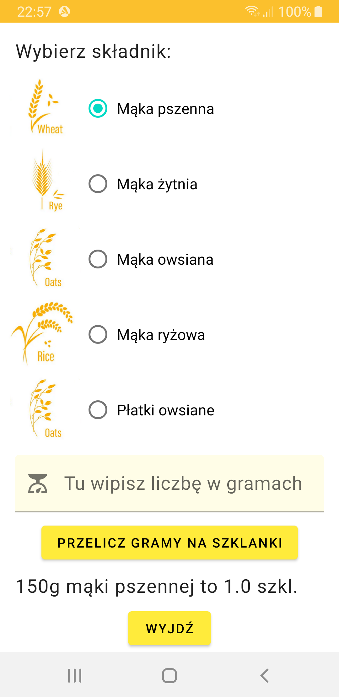
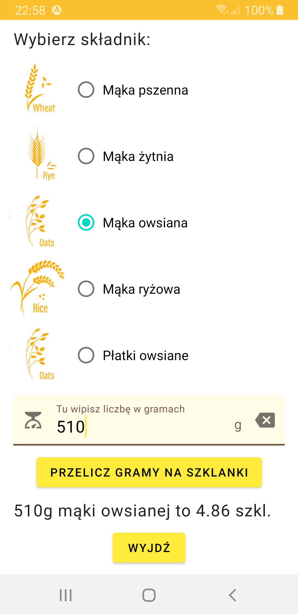

# Cup Calculator

Cup Calculator is an Android application developed as a freelance order. The app
calculates the conversion from grams to cups for five types of ingredients: wheat flour, rye flour,
oats flour, rice flour, and oat flakes. The app is designed to support the Polish language.

Calculator is designed for
•	Minimum SDK Version: Android 8.0 (Oreo, API level 26)
•	Android Version Targeted: Android 13 (API level 33)

## Screenshots

 

## Features

•	User selects the ingredient by checking one of the six radio buttons.
•	Checking one of the radio buttons will display the number of grams of the selected ingredient
    in one full cup (250 ml).
•	User enters the number of grams in the input text field.
•	User receives the conversion result by clicking the "Calculate" button.
•	The result is displayed in the text view as the number of grams of the chosen ingredient.
•   The app includes an exit button to allow users to close the app easily.
•   The text input field features a scale icon, a hint message, and a backspace icon.
    Clicking the backspace icon resets the input value.

## Error Handling
•	If the user clicks the "Calculate" button without entering a value, a snackbar with a reminder
    message will be displayed.

### Installation
To run the Cup Calculator project, follow these steps:

1. Clone the repository git clone:
   https://github.com/your-username/CupCalculator.git
   or
   Download ZIP file and repack on your disc
2. Open the project in Android Studio by clicking File in upper left corner of the main screen -> 
   Open -> Mark repacked file by clicking it once -> click OK.
3. Build and run the project on an emulator or a physical device with Android 8.0 or higher.

## Usage
Once the app is installed on your device, follow these steps to use the Cup Calculator:
1. Launch the app on your Android device.
2. Select the desired ingredient by checking the corresponding radio button.
3. Enter the number of grams in the input text field.
4. Tap the "Calculate" button.
5. The result will be displayed in the text view.

## Testing
The Cup Calculator project includes integration and unit tests.
To run the tests, you can use the testing frameworks provided by Android Studio.

## Technology and Libraries Used
•	Language: Kotlin
•	UI: XML, Material Design
•	Testing: JUnit 4, Mockito, Espresso
•	Android SDK
•	databinding
•	Coroutines (ViewModelScope)

## Terms of use
Feel free to download, copy and further customize the content and adapt it to your specific project.
If you have any more questions or need further assistance, feel free to ask!

